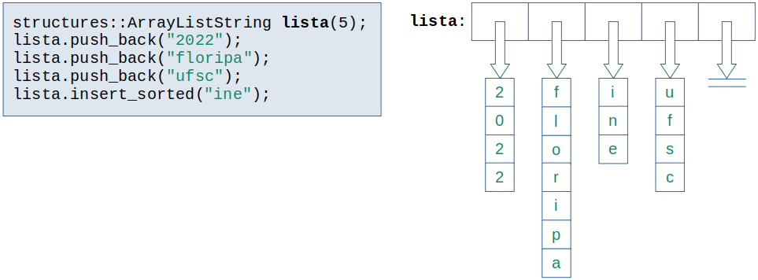

# Lista em vetor - aplicação de lista de ponteiros char

Uma lista pode ser formada por elementos do tipo vetor de qualquer comprimento. Neste exercício, estamos interessados em armazenar vetores do tipo char, ou seja, em cada posição da lista, será posicionada uma palavra/texto (vetor de char). Segue um exemplo:



## Algumas observações:

- Cada elemento da lista deve ser ponteiro para um vetor de caracteres de qualquer tamanho;
- Ao inserir um novo vetor de caracteres, deve-se:
    1. alocar memória exatamente para o seu tamanho; exemplo:
    ```c++
    char *datanew = new char[strlen(data)+1];
    ```
    2. copiar o conteúdo da palavra/texto para esta memória.
    3. posicionar o ponteiro char na lista (principal ou pai); por exemplo:
    ```C++
    ArrayList::insert(datanew, index);
    ```
Dicas:

o término da palavra/texto em um vetor de caracteres é definido pelo char especial `\0`.

`strlen()` - comprimento de um string.

`strcmp()` - compara o conteúdo entre dois strings, indicando a ordem alfabética (ver documentação)

`strcpy()` ou `snprintf()` - cópia de um string referenciado por um ponteiro "origem", para um novo espaço de memória referenciado pelo ponteiro "destino"

#### Escolha uma opção:
Usando `strcpy()`:  
```c++
strcpy(datanew, data);
```
Usando `snprintf()`:
```c++
snprintf(datanew, strlen(data)+1, "%s", data);
```
####  Documentação:
[cplusplus.com](http://www.cplusplus.com/reference/cstring/)