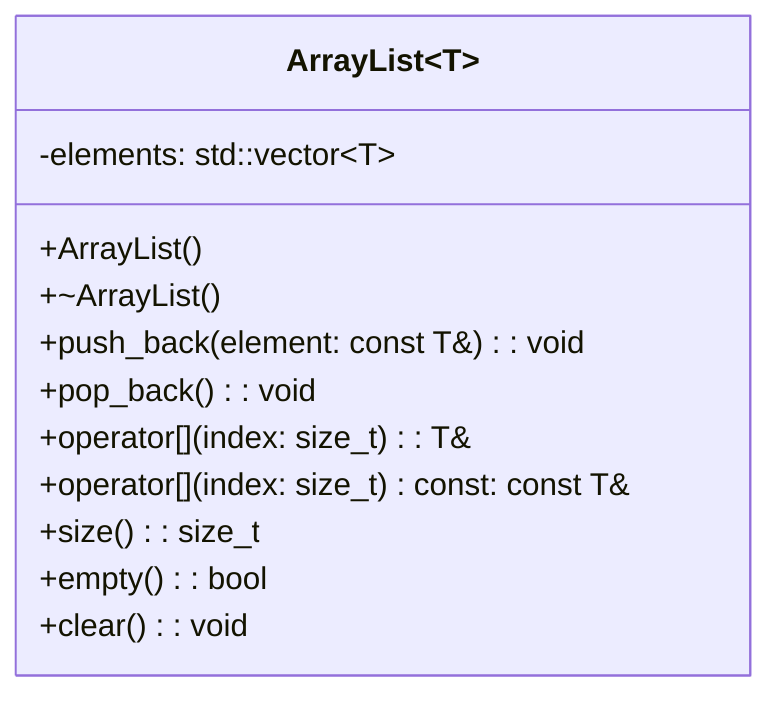
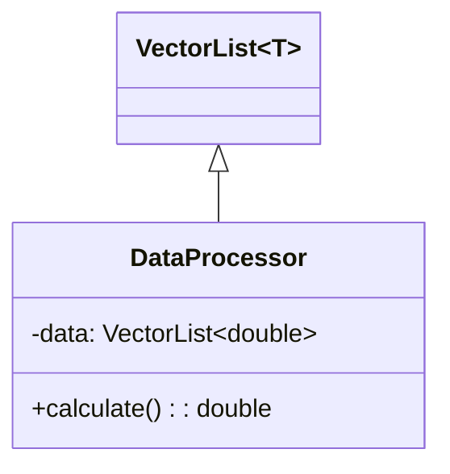

# Class Diagram
diagrama de classe Mermaid para a implementação do VectorList com templates:

## Elementos do Diagrama:

- Classe Template (VectorList~T~):
O parâmetro genérico T é indicado com notação ~T~.
- Atributo Privado:
elements: Vetor interno que armazena os elementos (std::vector~T~).
**Métodos Públicos**:
- Construtor/Destrutor: Padrão.
**Operações Básicas**:
- `push_back()`: Adiciona um elemento no final.
- `pop_back()`: Remove o último elemento.
- `operator[]`: Acesso por índice (com versão const).
**Utilitários**:
`size()`, `empty()`, `clear()`.

### Exemplo de Relacionamento (Uso em Outra Classe):

## Comparação com ArrayList:

| Feature          | VectorList (C++ style) | ArrayList (Java style) |
|------------------|------------------------|------------------------|
| **Adicionar**    | `push_back()`          | `add()`                |
| **Remover**      | `pop_back()`           | `remove(index)`        |
| **Acesso**       | `operator[]`           | `get(index)`           |
| **Modificação**  | `operator[]=`          | `set(index, value)`    |

Este diagrama reflete fielmente a implementação baseada em std::vector com interface STL-like. Para uma versão mais Java-like, veja o diagrama do ArrayList anterior.