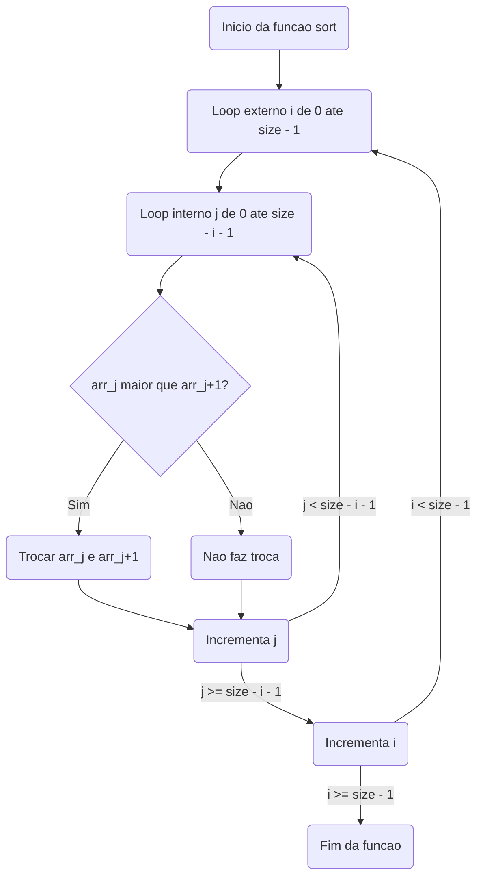

# Explicação da funçao sort()

## Por que usar dois laços for?
### Primeiro laço `(for (i = 0; i < size - 1; i++))`
- Controla o número total de passagens sobre o vetor.
- Cada iteração "empurra" o maior (ou menor) valor restante para sua posição final.
### Segundo laço `(for (j = 0; j < size - i - 1; j++))`
- Faz a comparação de cada par de elementos adjacentes.
- Realiza trocas quando necessário.
- O limite `size - i - 1` evita comparar os elementos já ordenados.

## Exemplo de como funciona:
Dado o vetor inicial `[10, -1, 0, 4, 2]`, o algoritmo faz o seguinte:

1ª Passagem: "Bolha" o maior número para o final → [-1, 0, 4, 2, 10]
2ª Passagem: "Bolha" o segundo maior número → [-1, 0, 2, 4, 10]
3ª Passagem: "Bolha" o terceiro maior número → [-1, 0, 2, 4, 10]
4ª Passagem: Como o vetor já está ordenado, nenhuma troca acontece.
## Complexidade do Algoritmo
### Melhor caso (vetor já ordenado):
- O Bubble Sort pode ser otimizado para O(n) (com uma flag para detectar quando não há trocas).
### Pior caso (vetor totalmente invertido):
- Faz todas as comparações possíveis, resultando em O(n²).
### Caso médio:
- Ainda é O(n²), pois em média faz a metade das trocas do pior caso.

O Bubble Sort não é eficiente para grandes conjuntos de dados, pois há algoritmos melhores como QuickSort (O(n log n)) e MergeSort (O(n log n)).
## Resumo
✅ Por que dois loops? Para comparar e ordenar elementos em cada iteração.

✅ Complexidade? O(n²) no pior caso, O(n) no melhor caso (com otimização).

✅ Por que Bubble Sort não é eficiente? Porque há algoritmos melhores para ordenar grandes conjuntos de dados. 🚀

## Aqui está o diagrama de fluxo para a função sort() em Mermaid:

## Explicação do Fluxograma
1. Loop Externo (i de 0 até size - 1)
- Controla as passagens sobre o vetor.
- Garante que, após cada iteração, o maior elemento restante seja "empurrado" para o final.
2. Loop Interno `(j de 0 até size - i - 1)`
- Percorre os elementos adjacentes do vetor.
- Compara os pares de elementos `arr[j] e arr[j+1]`.
3. Condição de Comparação
- Se `compare(arr[j], arr[j+1]) > 0`, então ocorre a troca dos elementos.
- Se não, segue sem alterações.
4. Atualizações
- `j` é incrementado e o processo repete até `j < size - i - 1`.
- Depois, `i` é incrementado e o processo continua até `i < size - 1`.
5. Fim da Função
- Quando todos os elementos estiverem ordenados, a função termina.
- Esse fluxo representa o Bubble Sort usando um ponteiro para função de comparação (compare), permitindo ordenação crescente ou decrescente. 🚀

> ver esta [Animação](https://www.cs.usfca.edu/~galles/visualization/ComparisonSort.html)