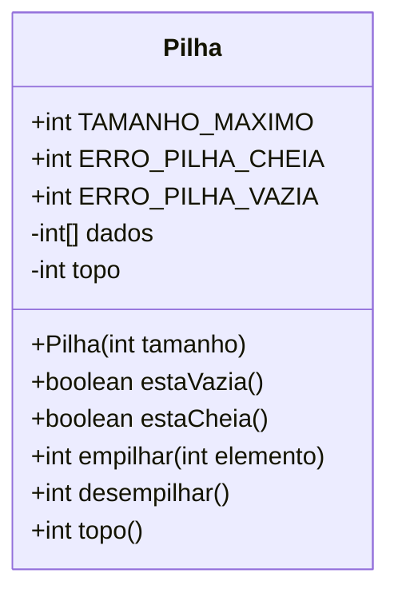

```mermaid
classDiagram
    class Pilha {
        +int TAMANHO_MAXIMO
        +int ERRO_PILHA_CHEIA
        +int ERRO_PILHA_VAZIA
        -int[] dados
        -int topo
        +Pilha(int tamanho)
        +boolean estaVazia()
        +boolean estaCheia()
        +int empilhar(int elemento)
        +int desempilhar()
        +int topo()
    }
```
